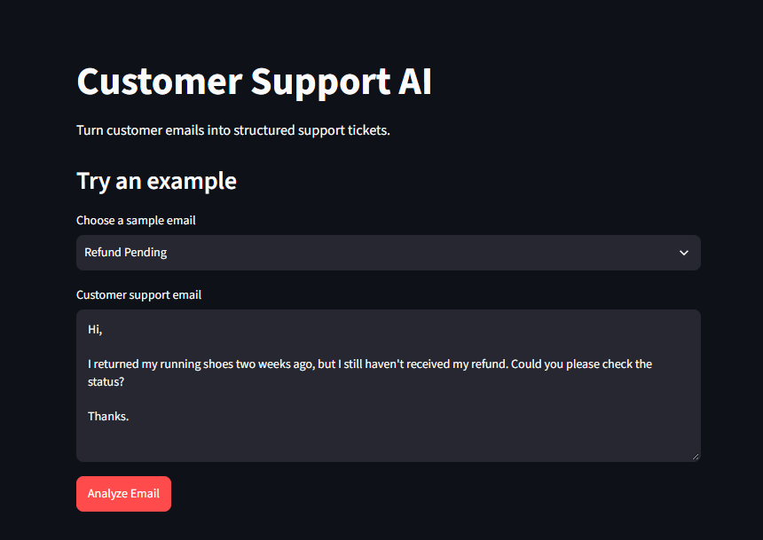
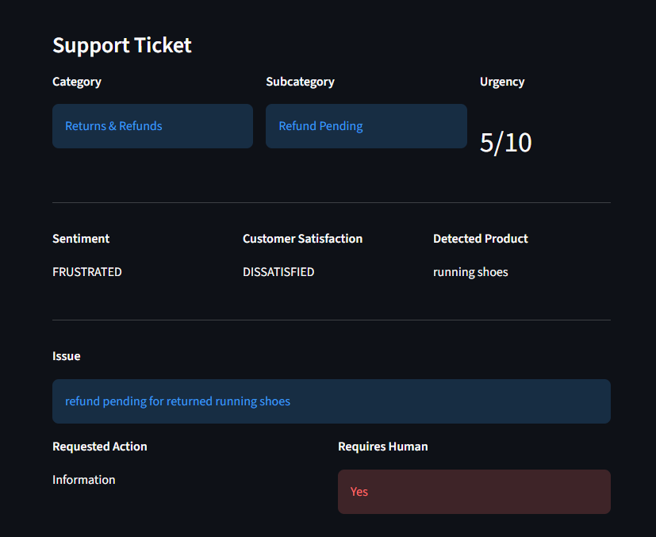

# Customer Support AI

A small fine-tuned LLM that turns customer support emails into structured support tickets.

Built with **Qwen2.5-0.5B-Instruct, LoRA, Unsloth and Streamlit.**

## What it does

Give it a customer support email and it extracts things like:

* Category and subcategory
* Urgency
* Sentiment
* Customer satisfaction
* Detected product
* Issue
* Requested action
* Whether a human is required

The output is returned as structured JSON.

## Screenshots





## The V1 → V4 Journey

This project went through a few iterations rather than getting everything right on the first try.

**V1** — First working version with a small synthetic dataset.

**V2** — Expanded the dataset and improved the training data.

**V3** — Refined the dataset and prompts, improving the model's consistency.

**V4** — Final version with better taxonomy rules, clearer instructions and more carefully generated examples.

Training loss went from roughly **0.50 in V1 → 0.20 in V4.**

## Evaluation: Base Model vs. Fine-Tuned

I tested both the base model and the fine-tuned model on 10 emails neither had seen 
before, using the exact same prompt, and checked the outputs by hand.

**Schema adherence** (did the output match the exact JSON structure — correct keys, 
no extra commentary or markdown wrapping):
| Model | Schema-correct |
|---|---|
| Base (Qwen2.5-0.5B-Instruct) | 0/10 |
| Fine-tuned (V4) | 10/10 |

The base model also wrapped its output in markdown code fences (` ```json `) in 
4/10 cases despite the prompt not asking for that, and used inconsistent, 
self-invented field names each time rather than a single consistent schema.

**Grounding** (did the output only use facts present in the email, with no 
invented details):

Example — email: *"I ordered a blue hoodie in medium, but the package contains 
a red hoodie. I need the correct item sent to me."*

- **Base model's output :**
- ```json
{
  "ticket_id": "123456",
  "status": "open",
  "priority": "high",
  "description": "Customer received an incorrect item in their order. They requested the correct item.",
  "customer_name": "John Doe",
  "customer_email": "johndoe@example.com",
  "product_name": "medium blue hoodie",
  "product_description": "A medium-sized blue hoodie with a red sleeve.",
  "product_price": "$100",
  "order_date": "2023-09-07",
  "order_status": "delivered",
  "delivery_notes": "The package contained a red hoodie instead of the expected medium blue hoodie.",
  "solution": {
    "item_to_send": "medium blue hoodie",
    "expected_delivery_date": "2023-10-01"
  },
  "resolution_timeframe": "next day
- invented a customer name, email address, order date, and price 
  — none of which appeared in the email.
- **Fine-tuned model's output : **
-{"category": "Product Issue", "subcategory": "Wrong Item", "urgency": 5, "sentiment": "FRUSTRATED", "customer_satisfaction": "DISSATISFIED", "detected_product": "blue hoodie", "issue": "Received wrong product (red hoodie instead of blue hoodie).", "requested_action": "Exchange", "requires_human": true}
- output only grounded fields: `category: Product Issue`, 
  `subcategory: Wrong Item`, `detected_product: blue hoodie`, with no fabricated details.

**Takeaway**: the base model can produce JSON, but without fine-tuning it doesn't 
reliably follow a fixed schema and tends to hallucinate plausible-sounding details 
not present in the source text. Fine-tuning on ~[however many] labeled examples 
taught the model to consistently follow the schema and stay grounded in the actual 
email content — to the point where it no longer needs an explicit JSON instruction 
in the prompt to do so.

## Model

* **Base:** Qwen/Qwen2.5-0.5B-Instruct
* **Fine-tuning:** LoRA
* **Training:** Unsloth + TRL
* **Interface:** Streamlit

## Project Structure

```text
cs-support-ticket-ai/
├── app.py
├── inference/
│   ├── classifier.py
│   └── model.py
├── Training/
├── Datasets/
├── requirements.txt
├── .gitignore
└── README.md
```

## Run

```bash
pip install -r requirements.txt
streamlit run app.py
```

The `Training` and `Datasets` folders contain the work used to build the final model.
`Training` Contains `Dataset_Generation.ipynb` , where the dataset was generated via Grok and
`Emails_LLM_v4` where the base model was fine-tuned.
`Datasets` contains `raw_emails.jsonl` which is the data grok generated and `emails.jsonl` , same data formatted for finetuning.


---

Made as a practical AI/ML engineering project to learn the full process of **dataset generation → fine-tuning → inference → application**.
